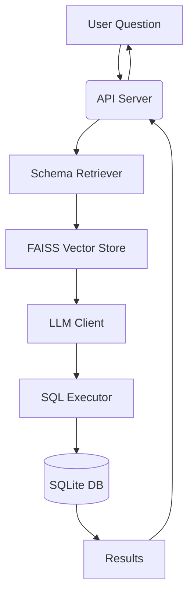

# AI-Powered Text-to-SQL API 🔍➡️


An enterprise-grade solution for converting natural language questions into optimized SQL queries using state-of-the-art AI models and vector search.


## Features ✨

- **Natural Language Understanding**: Transform plain English questions into executable SQL
- **Semantic Schema Retrieval**: FAISS-powered vector search for relevant database schemas
- **Secure Execution Engine**: Read-only SQL execution with query validation
- **Production-Ready API**: FastAPI endpoints with JWT authentication
- **Scalable Infrastructure**: Background task processing and index sharding

## Table of Contents 📚

- [Installation](#installation-)
- [Usage](#usage-)
- [API Documentation](#api-documentation-)
- [Configuration](#configuration-)
- [Architecture](#architecture-)
- [Contributing](#contributing-)
- [License](#license-)

## Installation 🛠️

### Prerequisites

- Python 3.8+
- [Groq API Key](https://console.groq.com/)
- SQLite databases for querying

```bash
# Clone repository
git clone https://github.com/yourusername/ai-sql-assistant.git
cd ai-sql-assistant

# Create virtual environment
python -m venv venv
source venv/bin/activate  # Linux/Mac
venv\Scripts\activate  # Windows

# Install dependencies
pip install -r requirements.txt

# Set up environment
cp .env.example .env
```

## Usage 🚀

### 1. Start the API Server

```bash
uvicorn app.main:app --reload --port 8000
```

### 2. Upload Database

```bash
curl -X POST "http://localhost:8000/api/upload" \
  -H "Content-Type: multipart/form-data" \
  -F "file=@/path/to/sales_database.sqlite"
```

#### Example Response:

```json
{
  "message": "Upload processing started",
  "db_id": "a1b2c3d4-sales_database.sqlite"
}
```

### 3. Ask Questions

```bash
curl -X POST "http://localhost:8000/api/chat" \
  -H "Content-Type: application/json" \
  -d '{
    "question": "Show top 5 customers by total purchases in 2024",
    "db_id": "a1b2c3d4-sales_database.sqlite"
  }'
```

#### Example Response:

```json
{
  "results": [
    {"customer_name": "Acme Corp", "total_spent": 150000},
    {"customer_name": "Globex", "total_spent": 142500}
  ],
  "sql": "SELECT customer_name, SUM(order_value) AS total_spent FROM orders WHERE ...",
  "error": null
}
```

## API Documentation 📚

### POST /api/upload

```python
@app.post("/upload")
async def upload_database(file: UploadFile, background_tasks: BackgroundTasks):
    """
    Upload SQLite database for processing
    :param file: SQLite database file
    :return: Processing status with database ID
    """
```

### POST /api/chat

```python
@app.post("/chat")
async def process_query(query: QueryRequest):
    """
    Process natural language query
    :param query: {
        "question": "Your question",
        "db_id": "uploaded_database.sqlite"
    }
    :return: Query results with generated SQL
    """
```

## Configuration ⚙️

### .env File:

```ini
# Core Configuration
GROQ_API_KEY=your_api_key_here
EMBEDDING_MODEL=BAAI/bge-small-en-v1.5

# Path Configuration
UPLOAD_DIR=./data/uploads
FAISS_INDEX=./data/faiss_index
SCHEMA_MAPPING=./data/schema_mapping.json

# Performance Settings
MAX_UPLOAD_SIZE_MB=50
```

## Architecture 🏡



### Key Components:

- **Schema Retriever**: Finds relevant tables using semantic search
- **Prompt Engineer**: Constructs LLM prompts with schema context
- **Query Executor**: Safely runs generated SQL queries
- **Vector Store**: FAISS index for fast schema retrieval

## Contributing 🤝

1. Fork the repository
2. Create feature branch (`git checkout -b feature/amazing-feature`)
3. Commit changes (`git commit -m 'Add amazing feature'`)
4. Push to branch (`git push origin feature/amazing-feature`)
5. Open Pull Request


